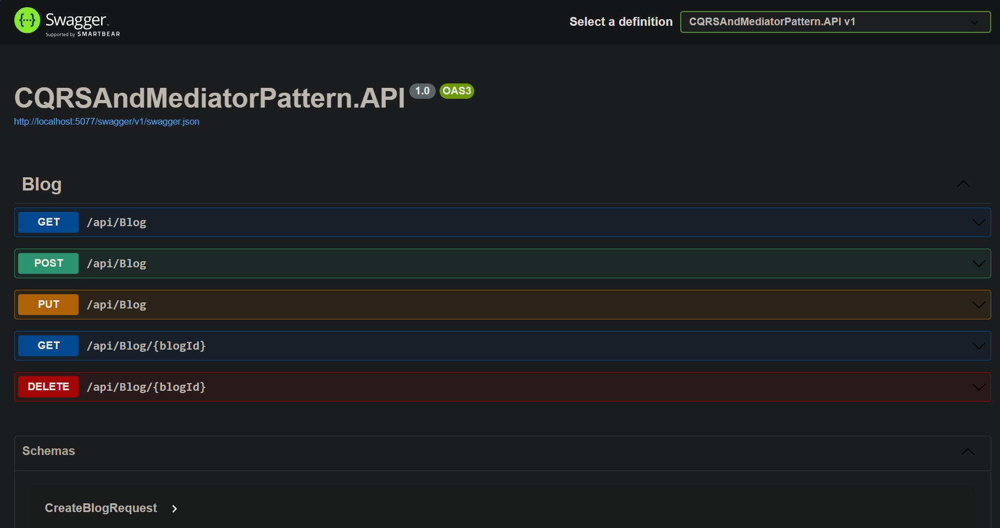

# Project Title

Blog Api

## Table of Contents

- [About](#about)
- [Getting Started](#getting-started)
- [Usage](#usage)

## About <a name="about"></a>

Blog API is implemented using CQRS the MediatR pattern. It provides functionalities for managing Blogs.



## Getting Started <a name="getting-started"></a>

These instructions will help you set up the project on your local machine for development and testing purposes.

### Prerequisites

Ensure you have the following installed:

- .NET 6 or higher (preferably .NET 8)
- .NET EF tools for migrations and database updates
- Your preferred code editor (VSCode is recommended)

### Installation

Follow these steps to get the development environment running:

1. Clone the Git repository:

    ```
    git clone https://github.com/Rahul8320/BlogApiCQRS
    ```

2. Restore packages:

    ```
    dotnet restore
    ```

3. Build the project:

    ```
    dotnet build
    ```

4. Run the project:

    ```
    dotnet watch run
    ```
    or
    ```
    dotnet run
    ```

## Usage <a name="usage"></a>

After running the project, access the Swagger page for an intuitive interface to interact with the application. Through Swagger, you can:

- Create a new blog.
- View a list of blogs with details like description and author.
- Update or Delete blog.

The Swagger page streamlines the process of managing blogs, making it easy and efficient to perform these tasks.
